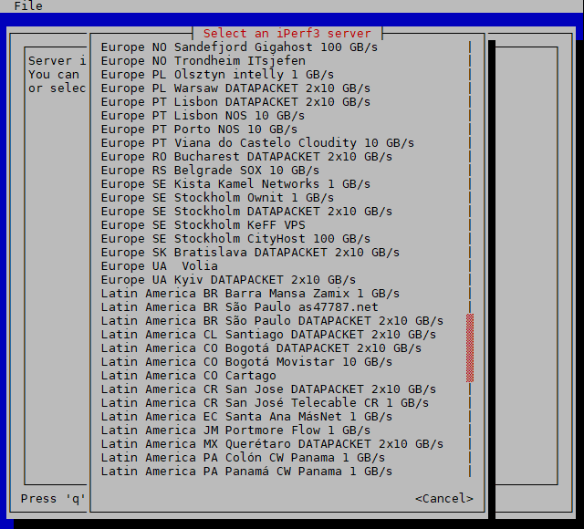

# iperf3-tui
Draw a moving speed test graph in your terminal

# Screenshots

# To use
Linux only

    git clone https://github.com/dmdmdm/iperf3-tui
    cd iperf3-tui
    cargo run <iperf3-server>

See public iperf3 servers on these pages:
- https://github.com/R0GGER/public-iperf3-servers
- https://iperf3serverlist.net
- https://iperf.fr/iperf-servers.php

Or run your own iperf3 server:

    iperf3 --server

# Options
    cargo run [-6][-p <port-range>][-R][-u] <iperf3-server>

Same meaning as the iperf3 command:
- -6: Use IPv6
- -p: port range - eg -p 5200-5209
- -R: reverse - server sends data
- -u: Use UDP

# Tips
If the characters of the graph don't show properly in putty:
- Window > Appearance > Font = DejaVu Sans Mono
- Window > Translation > Remote Character Set = UTF-8
