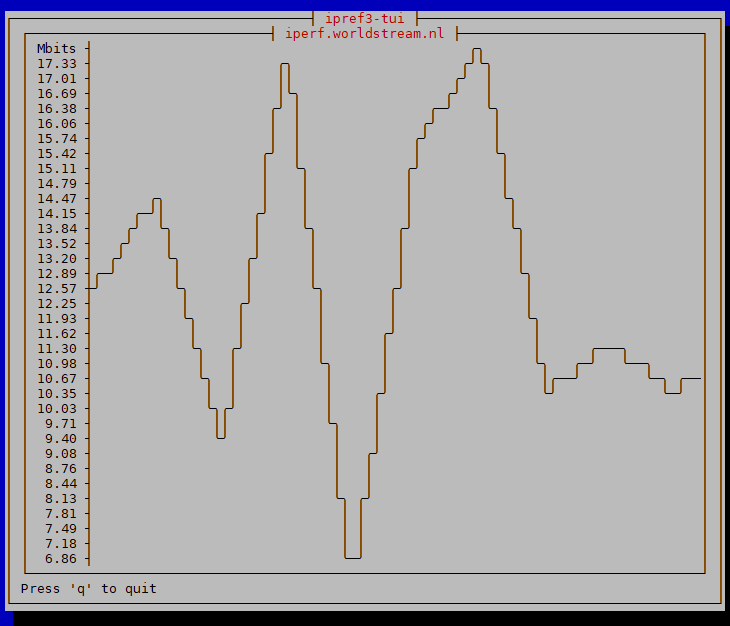

# iperf3-tui
Draw a speed test graph in your terminal

# Screenshot

# To use
Linux only

    git clone https://github.com/dmdmdm/iperf3-tui
    cd iperf3-tui
    cargo run <iperf3-server>

See public iperf3 servers on these pages:
https://github.com/R0GGER/public-iperf3-servers and 
https://iperf.fr/iperf-servers.php

Or run your own iperf3 server:

    iperf3 --server

# Tips
If the characters of the graph don't show properly in putty:
Window > Appearance > Font = DejaVu Sans Mono
Window > Translation > Remote Character Set = UTF-8
