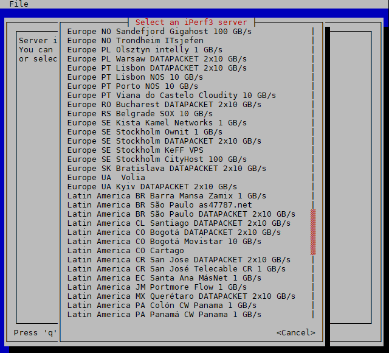

# iperf3-tui
Draw a moving speed test graph in your terminal

# Screenshots

Thank you to https://www.iperf3serverlist.net for the list of servers!

# To use
Linux only

    git clone https://github.com/dmdmdm/iperf3-tui
    cd iperf3-tui
    cargo run

If you don't have `git` or `cargo` they can be installed with with your disto's
package manager - eg `apt install cargo`

The app has a menu to select public iperf3 servers or run your own server with:

    iperf3 --server

# Options
If you prefer, you can specify a server and other options on the command line

    cargo run [-6][-p <port-range>][-R][-u] <iperf3-server>

The flags have the same meanings as the iperf3 command:
- -6: Use IPv6
- -p: port range - eg -p 5200-5209
- -R: reverse - server sends data
- -u: Use UDP

# Tips
If the characters of the graph don't show properly in putty:
- Window > Appearance > Font = DejaVu Sans Mono
- Window > Translation > Remote Character Set = UTF-8
